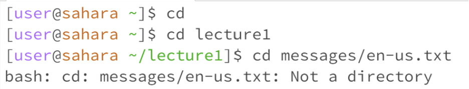
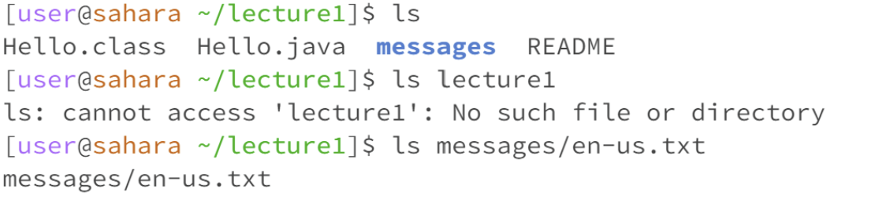
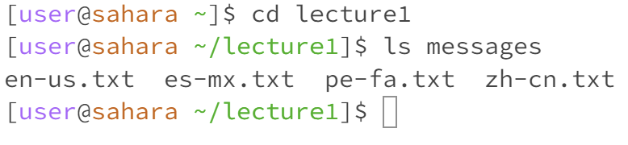
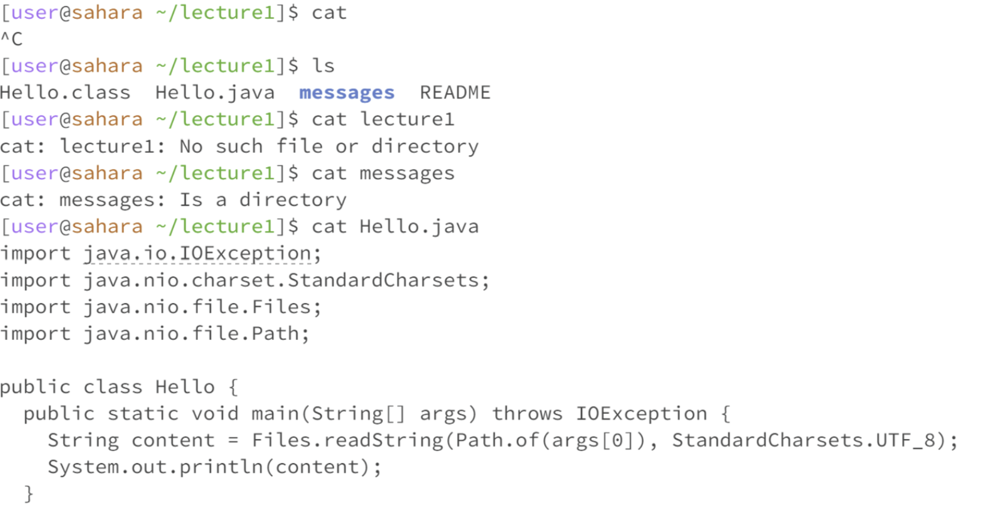

# Lab 1 Report

### Using the `cd` command

I tried using `cd` on its own and it did nothing as we did not give it a directory to switch to. The point of the `cd` command is to change the directory of our code/files, hence why it is "cd".
Then I tried `cd lecture1` which switched the directory to lecture1. That is because we specified a directory that we want to change to. 
Then when I tried using `cd` to a file, it gave an error saying that it is not a directory. The whole function of `cd` is to change directory, therefore, it will not work on a file. Thereafter, I tried the `cd` command with no arguments on my home page. It didn't do anything. Then I tried to change the direcoty and go to `lecture1/messages` and then run cd. This time it returned me to my home directory. Basically, if we are on a different working directory than our home one, and we try to run `cd`, it will just bring us back to our home directory.

***
### Using the `ls` command

When usinf the `ls` command by itself, it showed the names of the files and folders inside the current directory.
When using `ls lecture1`, it gave an error because we do not need to specify the directory as it will assume we are using the current working directory.
When using `ls messages/en-us.txt` it just shows `messages/en-us.txt` because that is the only file at that location. 
Horizontal rule:

***
### Using the `cat` command

When using `cat` by itself, it keeps us stuck within the command until we enter `^C` aka Ctrl C. That is basically an error.
When using `cat lecture1` we get a message saying `lecture 1 is a directory`. That is an erro because concatenating a directory is not possible. 
Wheb using `cat Hello.java` it displays the contents of Hello.java. 
The `cat` command basically shows the contents of a file and does not work on a directory. 
