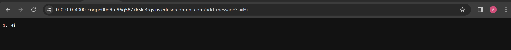
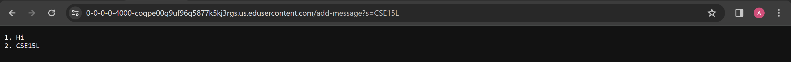
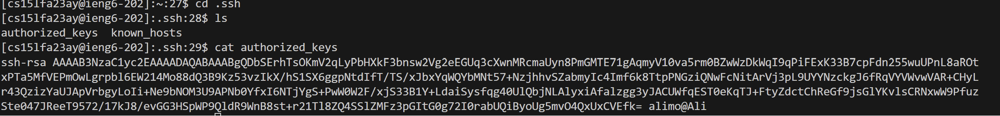
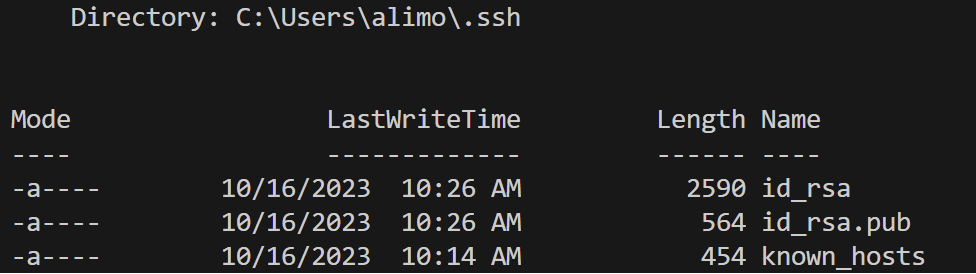
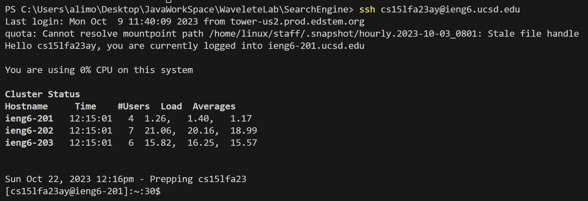

# Lab Report 2
#### Part 1
##### Code for `StringServer`
```java
import java.io.IOException;
import java.net.URI;
import java.util.List;
import java.util.ArrayList;


class Handler implements URLHandler {
    List < String > wordlist = new ArrayList < String > ();

    public String handleRequest(URI url) {
        if (url.getPath().equals("/")) {
            return toListS();
        } else if (url.getPath().equals("/add-message")) {
            if (url.getPath().contains("/add-message")) {
                String[] parameters = url.getQuery().split("=");
                if (parameters[0].equals("s")) {
                    wordlist.add(parameters[1]);
                    return toListS();
                }
            }
        }

        return "404 Not Found!";
    }

    public String toListS() {
        String result = "";
        for (int i = 0; i < wordlist.size(); i++) {
            result = result + wordlist.get(i) + "\n";
        }
        return result;
    }
}

class StringServer {
    public static void main(String[] args) throws IOException {
        if (args.length == 0) {
            System.out.println("Missing port number! Try any number between 1024 to 49151");
            return;
        }

        int port = Integer.parseInt(args[0]);

        Server.start(port, new Handler());
    }
}
```
##### Image 1 Using `add-message`


When we use anything after the /, aka giving the url a path, the Hnadler class looks at the input. It looks the given url path and compares it to "/add-message". If the url path is not the same then it will return an error message. If the url path is the same, then it will enter the next stage. The next step is to separate the equal sign from the message. Then it checks to see whether there is a "s" before the equal sign. This is basically the query check step. If it is equal to s then it will add the given word from the user to `wordlist`. In this case we give it "Hi" and "CSE15L". Word list is a string type arraylist, created to contain all of the given strings. Thereafter, the given paramaters are sent to a `toListS` function which basically turns them into a returnable string value. In this case it returns "Hi" in the first line then returns "CSE15L" in the second line. We do have to mention that there is a **handleRequest** method that takes care of all of that within the handler class. The `handleRequest` method takes it `URI` type. <br>
The type of `wordlist` is an arraylist of strings, however, it can take int values as displayed in the next image. That is because the arraylist takes the integer inputs and turns them into strings. As seen in the "CSE15L" example, it takes 15 and turns it into a string. One thing that was interesting was when I used spaces in the URI. In the actual URL section on google, the spaces were replaced by "%20", however, the spaces are replaced by plus signs on the return statement of the website.  


##### Image 2 Using `add-message`


I mirror the answer for the first image. This is the example where the URI includes a number. The specific argument given to handleRequest is `/add-message?s=CSE15L`. Then `handleRequest` splits it and takes "CSE15L" as the string to display. Basically what happens is that it assumes that the URI is going to be a type string and converts all of it to a string. Once you add the given URI to the ArrayList, it converts to String type. <br>
`wordlist` is initally just an empty arraylist of type string. When we added "Hi", it stored it as one of its elements. Then when we added "CSE15L", it also included that inside it. 

#### Part 2

##### Public Key



##### Private Key

`id_rsa` is the private key.


##### Logging In without password 



#### Part 3

SomethingI learned in week 2 and 3 was to set up a simple server and add simple commands to it. I found it a bit challenging changing the server from `NumberServer` to a `StringServer`. What this taught me was to experiment with different things and run tests to make sure everything works well. I was able to modify the code of `NumberServer` and change its functions to satisfy `StringServer`. <br>
Another skill that I improved on was just looking at code. I have experience of being given a code and its input/output and I was told to say what it does but this lab helped me improve those skills even more. I really liked when we were given the output in the skill demo and told to look through the code to see what is exactly happening, etc. <br>
Lastly, I enjoyed learning about the ssh command and remote computing. I have never had experience in connecting to another computer and making my directory there so it was a great new experience for me. 


