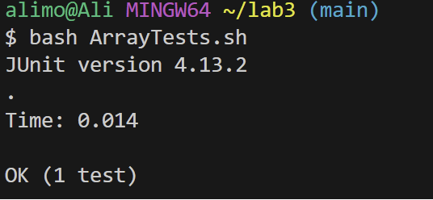
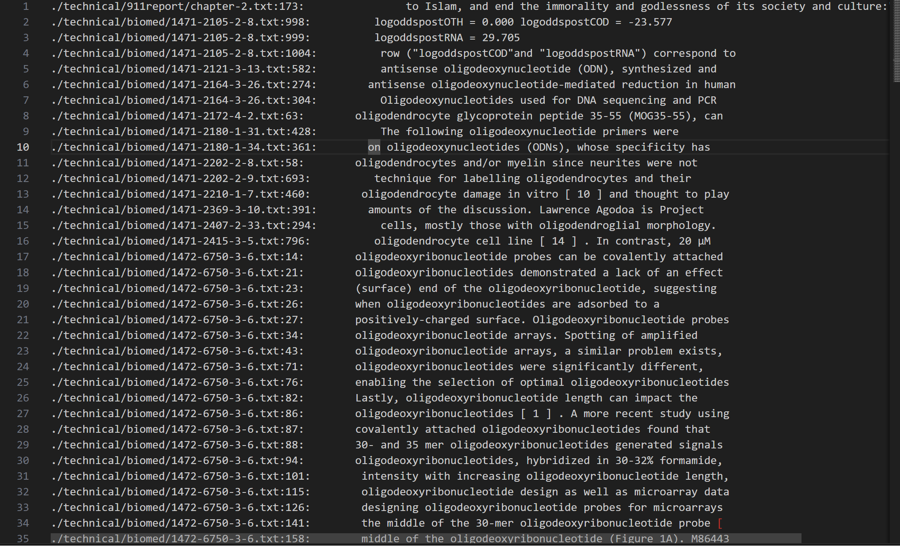

# Lab Report 3

## Part 1

##### Reverse In Place bug

##### Initial code:

```java
static void reverseInPlace(int[] arr) {
    for(int i = 0; i < arr.length; i += 1) {
      arr[i] = arr[arr.length - i - 1];
    }
  }
```
##### Failure inducing input

```java
int[] input = {1,2,3};
ArrayExamples.reverseInPlace(input);
assertArrayEquals(new int[]{3,2,1}, input);
```
The expected output is `{3,2,1}` but the actual output is `{3,2,3}`.
##### Input that doesn't induce failure

```java
int[] input1 = {0,0};
    ArrayExamples.reverseInPlace(input1);
    assertArrayEquals(new int[]{0,0}, input1);
```
The input is `{0,0}` and the output is also `{0,0}`
##### Screenshot 1 (Failure inducing input):


##### Screenshot 2 (Non-Failure inducing input): 



##### Before:

```java
static void reverseInPlace(int[] arr) {
    for(int i = 0; i < arr.length; i += 1) {
      arr[i] = arr[arr.length - i - 1];
    }
  }
```
##### After:

```java
static void reverseInPlace(int[] arr) {
    int temp ;
    for(int i = 0; i < arr.length / 2; i++) {
      temp = arr[i];
      arr[i] = arr[arr.length - i - 1];
      arr[arr.length - i - 1] = temp;
    }
  }
```
###### Explanation:

I basically created a temporary variable `temp` to keep track of the current number. Then I was able to change the number at the current index with the number at `arr.length-i-1`. And then I was able to change the number at `arr.length-i-1` to the first number because now I actually have that number stored in a temporary variable. <br>
Before creating the temporary variable, the function was just passing through the array and replacinf the number at the current index `i` with the number at index `arr.length-i-1`. This was producing the incorrect output because it was not keeping track of the number at the current index and swapping it with `arr.lentgh-i-1`.

## Part 2

#### Number 1 - counting the amount of times a specific word occurs:

##### Example 1:

```java
$grep -ro "god" ./technical | wc -l

53
```
##### Example 2:

```java
$ grep -ro "statement" ./technical/biomed | wc -l

74
```
##### Explanation:

- The `-r` option in `grep` enables a recursive search within directories. When combined with the `-r` flag, `grep` searches for the specified parameter, in this case "god", in all files within the given directory, in this case `technical` and `technical/biomed`, and its subdirectories.

- The `-o` option in `grep` tells `grep` to output only the matched parts of the lines rather than entire lines. So if we run `grep -ro "god" ./technical`, it will return the files that include god and the word god itself. 

- `wc -l` command stands for "word count". When used with the `-l`, it counts the number of lines. By piping the output of grep to wc `-l`, it calculates the total number of lines that grep finds in the files. Since `-o` in grep ensures that each match is on a separate line, `wc -l` effectively counts the total number of occurrences of the word or pattern. 

- Therefore, combining `grep -ro "god" ./technical | wc -l` displays the amount of times that the word "god" appears withing the files inside the `techncial` directory. We can change the word that we are looking for as well the specific directory that we look into, making this very useful if looking for a specific statement, word, or sentence.
#### Number 2 - finding the line that the specific word is placed at:

##### Example 1: 

```java
$ grep -nr "imagine" ./technical/biomed

./technical/biomed/1471-213X-1-13.txt:383:          dlA dx2 mutant embryos. We imagined
./technical/biomed/1471-2148-3-3.txt:138:        away from this genotype by adding mutations, imagine that
./technical/biomed/1471-2156-3-4.txt:763:          previously imagined.
./technical/biomed/1471-2164-3-19.txt:273:        imagine two szenarios making ROC analysis inappropriate for
./technical/biomed/1471-2202-3-5.txt:158:          perspective: If we imagine that
./technical/biomed/1471-2288-2-11.txt:12:          change the age of death. As an analogy, imagine waiting
./technical/biomed/1471-2288-3-9.txt:69:        - in what they imagined to be a flawless mechanistic
./technical/biomed/1471-2431-2-11.txt:15:        classroom students sometimes use self-hypnosis to imagine
./technical/biomed/1471-2431-2-11.txt:111:        control. Typically, children chose to imagine a favorite
./technical/biomed/1471-2431-2-11.txt:114:        symptom. For example, some patients learned to imagine the
./technical/biomed/1471-2431-2-11.txt:116:        to imagine changing the appearance to a normal one.
./technical/biomed/1471-2431-2-11.txt:128:        in a few minutes, by suggesting that the patient imagine
./technical/biomed/1471-2458-3-20.txt:354:        accurately imagined. Nonetheless, it is worth noting that
./technical/biomed/1472-6750-2-21.txt:329:          such as luciferase. It is also possible to imagine that
./technical/biomed/1472-684X-2-1.txt:272:        system, it is easy to imagine how a resident's reluctance
./technical/biomed/1476-4598-2-28.txt:579:        101 ] , as one can imagine that the cooperative action of
./technical/biomed/1477-7827-1-13.txt:508:          one might imagine, e.g. just placental aging. Table
./technical/biomed/gb-2001-2-4-research0010.txt:785:        imagined.
./technical/biomed/gb-2001-2-4-research0012.txt:328:          imagined) so that diagrams can be easily drawn by hand or
```
##### Example 2:

```java
grep -nr "god" ./technical > godIntechnical.txt
```
##### Output: 


Inside the `.txt` file.

###### Explanation: 

- The `-n` displays the line number with the matched line. When used, `grep` will print the line number before each line containing the matched pattern/paramtere, in this case "god" and "imagine".
- In the first example, we are looking for the word "imagine" inside the `biomed` folder. The terminal directly returns every occurrence of imagine with the specific file and line.
- In the second case, we looked for the word "god" inside the entire `technical` directory and then stored all of the occurrences inside a `.txt` file named `godIntechnical`. This is practical when there are a lot of occurrences of a certain pattern because insetad of having 1,000 lines of code on the terminal, we store them inside a `.txt` file and can use that in other cases.
#### Number 3 - before-context and after-context:

##### Example 1:

```java
$grep -m 1 -B 2 -A 2 "emergency" ./technical/911report/chapter-1.txt

    The hijackers quickly gained control and sprayed Mace, pepper spray, or some other irritant in the first-class cabin, in order to force the passengers and flight attendants toward the rear of the plane. They claimed they had a bomb.

    About five minutes after the hijacking began, Betty Ong contacted the American Airlines Southeastern Reservations Office in Cary, North Carolina, via an AT&T airphone to report an emergency aboard the flight. This was the first of several occasions on 9/11 when flight attendants took action outside the scope of their training, which emphasized that in a hijacking, they were to communicate with the cockpit crew. The emergency call lasted approximately 25 minutes, as Ong calmly and professionally relayed information about events taking place aboard the airplane to authorities on the ground.     

    At 8:19, Ong reported:"The cockpit is not answering, somebody's stabbed in business class-and I think there's Mace-that we can't breathe-I don't know, I think we're getting hijacked." She then told of the stabbings of the two flight attendants.
```
##### Example 2: 

```java
$grep -r -m 1 -B 1 -A 1 "God" ./technical/biomed

./technical/biomed/1471-2091-2-13.txt-        The dispersion of the intein as a selfish genetic
./technical/biomed/1471-2091-2-13.txt:        element is consistent with the work of Goddard and Burt [
./technical/biomed/1471-2091-2-13.txt-        38 ] on the persistence of an intron with homing
--
./technical/biomed/1471-2172-2-10.txt-          +individuals (Hispanic) under the direction of Dr. Harold
./technical/biomed/1471-2172-2-10.txt:          I. Laroche and Dr. E. Godreau, Center for Diagnosis and
./technical/biomed/1471-2172-2-10.txt-          Treatment, Ponce. The aged population, recruited from the
--
./technical/biomed/1471-2210-1-3.txt-          culture medium. Separation of islets was carried out
./technical/biomed/1471-2210-1-3.txt:          using dispase (1000 U/ml, Godo Shusei, Japan) as
./technical/biomed/1471-2210-1-3.txt-          previously described [ 35 ] . Separated cells were again
--
./technical/biomed/1472-6882-1-7.txt-          Hallelujah Acres, Inc. (
./technical/biomed/1472-6882-1-7.txt:          God's Way to Ultimate Health, Recipes
./technical/biomed/1472-6882-1-7.txt-          for Life...from God's Garden, 21 Days to health the
--
./technical/biomed/1477-7827-1-17.txt-          bovine IFNγ (200 IU/ml; generous gift from Dr. Dale
./technical/biomed/1477-7827-1-17.txt:          Godson, Veterinary Infectious Disease Organization,
./technical/biomed/1477-7827-1-17.txt-          University of Saskatchewan, Saskatoon, Saskatchewan,
--
./technical/biomed/gb-2002-3-10-research0055.txt-          'tryptophanyl-tRNA synthetase', 'Sky' = 'TYRO3 protein
./technical/biomed/gb-2002-3-10-research0055.txt:          tyrosine kinase', 'God' = 'Godzilla'). Short acronyms are
./technical/biomed/gb-2002-3-10-research0055.txt-          especially problematic (for example, 'CT', the
```
###### Explanation:

- The `-B` and the `-A` stand for before and after. Badically, they take in a paramater number, to display that many lines before and after the specified paramter, hence why they get their name "before-context" and "after-context". In this case, I used the word "emergency" and "God" and checked the context of each. In the first, I commanded that two lines before and two lines after the word emergency be displayed. In the second case, I commanded one line before and one line after.
- The `-m` is used to limit the count of matches. Basically, if there is no `-m` every case of the paramter will be displayed with the before and after counts.
- In the second exampele, I used `-r` (recursive), which allowed me to see multiple occurrences of the word "God" wil one line before and one line after it.
- This can be useful if one is trying to track down a certain pattern, but needs to see some context for the word. Therefore one can use before and after to see what surrounds the pattern.
#### Number 4 - searching for multiple patterns:

##### Example 1:

```java
$ grep -r -e "medicine" -e "blood" ./technical/biomed/ | wc -l
1689
```
##### Example 2:

```java
$ grep -r -e "court" -e "painful" ./technical/biomed/

./technical/biomed/1471-2164-3-9.txt:        quick-to-court (a mutation that
./technical/biomed/1471-2202-3-1.txt:        the male courtship song, and such acoustical data have been
./technical/biomed/1471-2202-3-1.txt:        courtship song, and locomotor-activity rhythms occur on
./technical/biomed/1471-2202-3-1.txt:        courtship song rhythms [ 19 20 ] , but not heartbeat [ 25 ]
./technical/biomed/1471-2202-3-1.txt:        rhythmic IPI in courtship song). However, we have been
./technical/biomed/1471-2202-3-1.txt:          rhythmicity [see [ 21 ] for examples involving courtship
./technical/biomed/1471-2202-3-1.txt:          observed in the analysis of courtship song as a
./technical/biomed/1471-2202-3-1.txt:          maximal courtship was placed in the recording chamber
./technical/biomed/1471-2202-3-10.txt:          Sigma, L-2020), agrin (1:40, courtesy of Dr. Herman
./technical/biomed/1471-2210-1-4.txt:          doses of olanzapine (provided as a courtesy by Ely Lilly,
./technical/biomed/1471-2334-1-17.txt:          Program, Rockville, MD; courtesy of Drs. D. Burton, H.
./technical/biomed/1472-6750-2-2.txt:        vehicles for TFX to the infection court.
./technical/biomed/1472-684X-1-5.txt:          effective, and much less painful.
./technical/biomed/1472-684X-2-2.txt:        painful therapeutic procedures (e.g. wound debridement and
./technical/biomed/1472-6882-1-10.txt:          any painful or swollen joints and inner body parts [ 94
./technical/biomed/1472-6882-1-7.txt:          being painful upon palpation. Subjects underwent a
./technical/biomed/1472-6882-1-7.txt:        painful tender points were found among responders and
./technical/biomed/1472-6890-3-2.txt:          and 16 were received courtesy of Dr E-M de Villiers
./technical/biomed/1476-511X-1-2.txt:          Boulogne-Billancourt, France), which consisted of
./technical/biomed/1476-511X-1-2.txt:          Boulogne-Billancourt, France), rinsed as described for
./technical/biomed/ar309.txt:          have at least 10 painful and 10 swollen joints at entry.
./technical/biomed/ar745.txt:        painful and debilitating joints, with progressive
./technical/biomed/bcr284.txt:          60-70% confluence were treated with SAHA (courtesy of Dr
```
###### Explanation: 

- The `-e` allows us to search for multiple differe patterns at once.
- For the first example, I looked for the occurrences of the words "blood" and "medicine" in the `biomed` directory and found that there are 1,689 occurrences of them.
- In the second example, I did not use `wc` and just returned the actual occurrences of the words "court" and "painful".
- This can be useful when searching for multiple different patterns all at once. 
### Sources:

##### Source 1:

- **ChatGPT** :
- **Prompt 1**: "how to use grep to search for a certain word in all the files in a folder and i just care about the count not the actual location of each"
- **Response 1**: "If you're interested in only counting the occurrences of a specific word in all files within a folder using grep, you can use the -ro option along with the wc command to count the total number of matches. Here's how you can do it:
`grep -ro "your_word_to_search" /path/to/your/folder | wc -l`
Replace "your_word_to_search" with the word or pattern you want to count, and `/path/to/your/folder` with the actual path to the folder where you want to perform the search.
For example, to count the occurrences of the word "example" in all files within a folder named "documents" located in your current directory:
`grep -ro "example" ./documents | wc -l`
This command will count the total number of occurrences of the word "example" in all files within the "documents" folder without displaying the actual location of each occurrence."
**I changed this by using my own parameters and also using this on a whole directory rather than just one file.**
- **Prompt 2**: "Give me a few grep options i can use for big directories full of files"
- **Respone 2**: "Absolutely, when dealing with large directories full of files, there are several grep options that can be particularly useful: -r or --recursive: This option allows grep to perform a recursive search, going through all files within the specified directory and its subdirectories.

Example:
`grep -r "pattern" /path/to/directory`
-i or --ignore-case: This option enables case-insensitive searches, which can be beneficial when you're unsure about the exact casing of the word you're looking for.

`grep -i "pattern" /path/to/directory`
-n or --line-number: This option displays the line number along with the matched line. It helps in quickly locating matches within files, which can be especially helpful in large files.

--before-context and --after-context: These options allow you to print a specific number of lines before and after the matched line, providing context around the matches.

Example:
`grep --before-context=2 --after-context=2 "pattern" file.txt`

Example:
`grep -r "pattern" --include "*.txt" /path/to/directory`
`grep -r "pattern" --exclude "*.log" /path/to/directory`
--color=auto: This option highlights the matching text with color, making it easier to identify the matched pattern.
Example:
`grep --color=auto "pattern" /path/to/directory`
-o or --only-matching: This option displays only the matched parts of the lines rather than entire lines. Useful for extracting specific information from larger files.

Example:
`grep -o "pattern" /path/to/directory` "
**I used the before-context and after-context option from this response and changed to my own parameter and directory. I also added the `-m` so that I could control the number of times the pattern was displayed.**
##### Source 2: 

- https://www.gnu.org/software/grep/manual/grep.html
- This website is basically a cheat sheet of all the `grep` options. I used this to find the options and then experimented with the options on my own.
