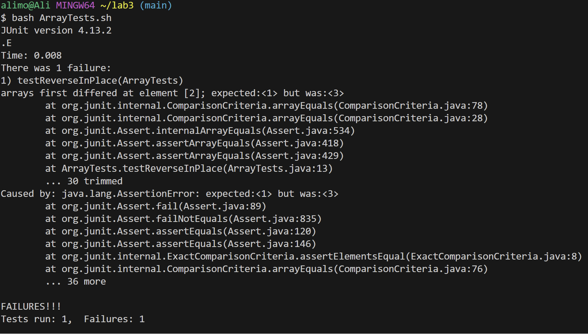

# Lab Report 3
## Part 1
##### Reverse In Place bug
##### Initial code:
```java
static void reverseInPlace(int[] arr) {
    for(int i = 0; i < arr.length; i += 1) {
      arr[i] = arr[arr.length - i - 1];
    }
  }
```
##### Failure inducing input
```java
int[] input = {1,2,3};
ArrayExamples.reverseInPlace(input);
assertArrayEquals(new int[]{3,2,1}, input);
```
The expected output is `{3,2,1}` but the actual output is `{3,2,3}`.
##### Input that doesn't induce failure
```java
int[] input1 = {0,0};
    ArrayExamples.reverseInPlace(input1);
    assertArrayEquals(new int[]{0,0}, input1);
```
The input is `{0,0}` and the output is also `{0,0}`
##### Screenshot 1 (Failure inducing input):

##### Screenshot 2 (Non-Failure inducing input): 


##### Before:
```java
static void reverseInPlace(int[] arr) {
    for(int i = 0; i < arr.length; i += 1) {
      arr[i] = arr[arr.length - i - 1];
    }
  }
```
##### After:
```java
static void reverseInPlace(int[] arr) {
    int temp ;
    for(int i = 0; i < arr.length / 2; i++) {
      temp = arr[i];
      arr[i] = arr[arr.length - i - 1];
      arr[arr.length - i - 1] = temp;
    }
  }
```
###### Explanation:
I basically created a temporary variable `temp` to keep track of the current number. Then I was able to change the number at the current index with the number at `arr.length-i-1`. And then I was able to change the number at `arr.length-i-1` to the first number because now I actually have that number stored in a temporary variable. <br>
Before creating the temporary variable, the function was just passing through the array and replacinf the number at the current index `i` with the number at index `arr.length-i-1`. This was producing the incorrect output because it was not keeping track of the number at the current index and swapping it with `arr.lentgh-i-1`.

## Part 2

#### Number 1 - counting the amount of times a specific word occurs:
##### Example 1:
```java
grep -ro "god" ./technical | wc -l
$ 53
```
##### Example 2:
```java
grep -ro "statement" ./technical/biomed | wc -l
$ 74
```
##### Explanation:
- The `-r` option in `grep` enables a recursive search within directories. When combined with the `-r` flag, `grep` searches for the specified parameter, in this case "god", in all files within the given directory, in this case `technical` and `technical/biomed`, and its subdirectories.

- The `-o` option in `grep` tells `grep` to output only the matched parts of the lines rather than entire lines. So if we run `grep -ro "god" ./technical`, it will return the files that include god and the word god itself. 

- `wc -l` command stands for "word count". When used with the `-l`, it counts the number of lines. By piping the output of grep to wc `-l`, it calculates the total number of lines that grep finds in the files. Since `-o` in grep ensures that each match is on a separate line, `wc -l` effectively counts the total number of occurrences of the word or pattern. 

- Therefore, combining `grep -ro "god" ./technical | wc -l` displays the amount of times that the word "god" appears withing the files inside the `techncial` directory. We can change the word that we are looking for as well the specific directory that we look into, making this very useful if looking for a specific statement, word, or sentence.
#### Number 2 - 

